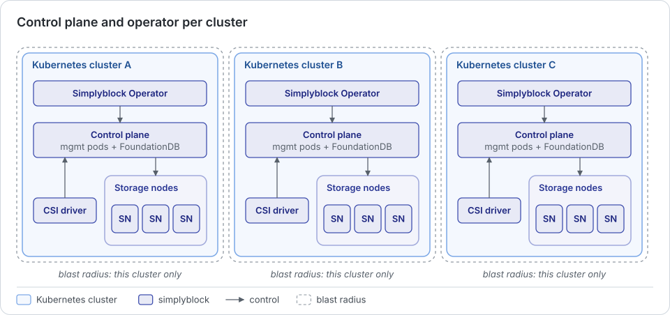
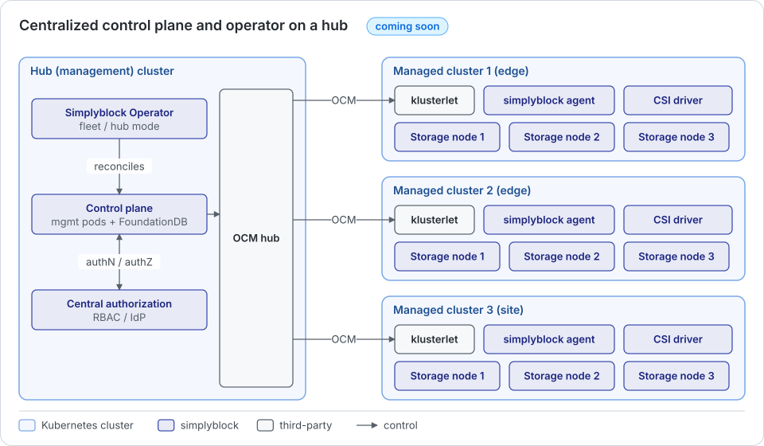

The simplyblock control plane holds the state of the storage clusters, exposes the Management API, and orchestrates
the storage nodes. The Simplyblock Operator reconciles the simplyblock custom resources into control plane calls.
Both can be deployed locally on every Kubernetes cluster that consumes or provides simplyblock storage, or, in the
future, centrally on a hub cluster that manages many Kubernetes clusters. The choice is independent of the storage
placement (hyper-converged, disaggregated, or hybrid).

## Local Control Plane and Operator

In the local model, every Kubernetes cluster runs its own control plane (management pods and FoundationDB), its own
Simplyblock Operator, the CSI driver, and the storage nodes of its storage clusters. This is the model that is
available today and that the installation guides describe. See
[Control Plane Cluster Architecture](../../kubernetes/installation/management-cluster-architecture.md).

Characteristics of the local model:

- **Isolation:** Every cluster is managed independently. Configuration, credentials, and custom resources of one
  cluster are not visible to another one.
- **Small blast radius:** A failure or misconfiguration of a control plane affects only the storage clusters of its
  own Kubernetes cluster.
- **Independent upgrades:** Each cluster upgrades its control plane, operator, and storage nodes on its own
  schedule.
- **No cross-cluster dependency:** Storage provisioning and failover handling in a cluster do not depend on the
  availability of any other cluster or of a wide-area network link.

The cost of the local model is that every cluster carries a full control plane, including a three-node FoundationDB
cluster, and that every cluster is operated separately. For a small number of medium or large clusters, this is
rarely a concern. For a large number of small clusters, the per-cluster footprint and the operational effort grow
with the number of clusters.

A single local control plane can manage more than one storage cluster. See
[Deployment Architectures](../../deployment-preparation/deployment-architectures.md) for a Kubernetes cluster with
several storage clusters.

## Centralized Control Plane and Operator on a Hub

!!! info "Coming soon"
    The hub deployment of the Simplyblock Operator and control plane is not released yet. The description below
    outlines the intended architecture and may change before release.

    In the hub model, a hub (management) cluster runs the simplyblock control plane and the central operator
    components. The managed Kubernetes clusters run only lightweight simplyblock agents, the CSI driver, and the
    storage nodes. The hub holds the desired configuration of every managed cluster and ships it to the cluster
    through Open Cluster Management (OCM), and each managed cluster reports back what it applied.

    

    Characteristics of the hub model:

    - **Central management of many clusters:** Storage clusters, storage classes, and CSI driver deployments of all
      managed clusters are declared and observed in one place. This suits fleets of many small clusters, for example,
      edge locations.
    - **Central authorization:** Access to storage management is granted once on the hub instead of separately on
      every managed cluster.
    - **Minimal footprint on managed clusters:** Managed clusters do not run a control plane or FoundationDB, which
      frees resources on small clusters.
    - **Delivered through Open Cluster Management:** Managed clusters register with the hub through the OCM
      klusterlet. The hub does not store kubeconfigs of the managed clusters.

## Comparison

| Aspect                                       | Local                                                            | Hub (coming soon)                                             |
|----------------------------------------------|------------------------------------------------------------------|---------------------------------------------------------------|
| Control plane location                       | Each Kubernetes cluster                                          | Hub cluster                                                   |
| Components on a consuming or storage cluster | Operator, control plane, FoundationDB, CSI driver, storage nodes | Lightweight agents, CSI driver, storage nodes, OCM klusterlet |
| Blast radius of a management failure         | One Kubernetes cluster                                           | Management operations of all managed clusters                 |
| Upgrades                                     | Per cluster                                                      | Coordinated from the hub                                      |
| Authorization                                | Per cluster                                                      | Central on the hub                                            |
| Dependency on other clusters                 | None                                                             | Management operations depend on the hub                       |
| Typical use                                  | Few medium to large clusters, strict isolation                   | Many small clusters, for example, edge fleets                 |

## Relation to the Disaster Recovery Hub

Disaster recovery uses a hub cluster as well. The DR hub runs the Open Cluster Management hub, the Ramen hub
operator, and dr-hub, and it coordinates failover and relocation between site clusters. The DR hub works with local
control planes on the sites today. Once the hub model for simplyblock storage is released, the same hub cluster can
host both the DR components and the centralized control plane and operator.

The hub requirements are described in
[Disaster Recovery Requirements](../../deployment-preparation/dr-requirements.md), and the combinations of DR and
management topologies in [Deployment Architectures](../../deployment-preparation/deployment-architectures.md).
