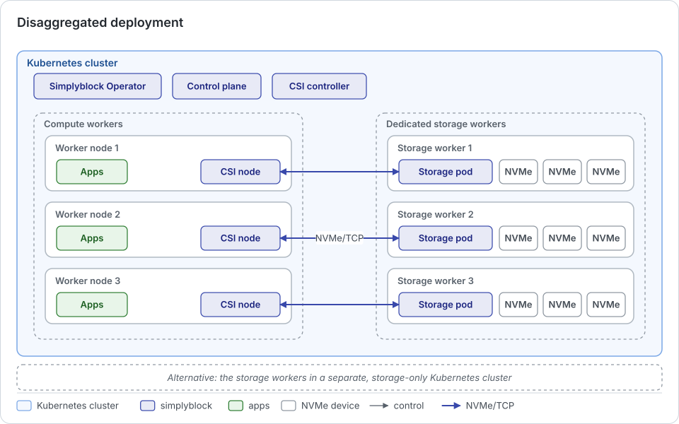

In a disaggregated deployment, dedicated storage nodes operate separately from the compute nodes that run the
applications. By default, the storage cluster runs in the same Kubernetes cluster as the applications, but on
dedicated worker nodes that host no application workloads. Applications access their volumes over NVMe-oF
(NVMe/TCP or NVMe/RoCE).

## How It Works

The Simplyblock Operator, the control plane, the CSI driver, the applications, and the storage nodes all run in one
Kubernetes cluster. The storage nodes run on workers that are selected for storage only, and the CSI driver runs on
the compute workers and connects each volume to the storage nodes over the network. The main difference from the
[hyper-converged model](hci.md) is the separation of storage and compute resources: no application pods share a
worker with a storage node. Operations stay the same as in a hyper-converged deployment, since both are driven by the
same operator in the same cluster.

## Separate Storage Cluster

As an alternative to the default, the storage workers can form a separate Kubernetes cluster that only provides
storage. The applications then run in one or more other Kubernetes clusters, which consume the storage over NVMe-oF
and connect to the storage cluster's control plane (see
[Connecting to an External Control Plane](../../kubernetes/installation/install-csi.md)). This variant fits when
storage is served to several Kubernetes clusters or when the storage infrastructure is owned by a separate team.

## Benefits

- **Independent scalability:** Compute and storage scale separately, which avoids unnecessary hardware expansion.
  For example, a small compute cluster with I/O-intensive workloads may still require a lot of storage capacity and
  IOPS.
- **Independent lifecycle:** Storage and compute are maintained, upgraded, and replaced independently of each other.
  Worker node upgrades, maintenance, and reboots on the compute side do not affect the storage nodes.
- **Controlled storage performance:** Latency, throughput, and IOPS are easier to control, since storage nodes do not
  compete with application workloads for CPU, memory, or network.
- **Hardware independence:** As with hyper-converged storage, components and nodes can be replaced independently of
  the software, with hardware from different vendors, and in gradual, rolling replacements.

## Considerations

- **No data locality:** Every I/O crosses the network between compute and storage workers.
- **Minimum scale:** The storage cluster has a minimum size of its own, independent of the size of the compute
  cluster.
- **Scaling alignment:** Storage and compute are sized separately, so a change in the compute demand can require a
  separate adjustment of the storage cluster.

## When to Choose Disaggregated

A disaggregated deployment is the preferred choice when:

- Storage capacity or performance needs differ strongly from compute needs.
- Compute workers are upgraded, rebooted, or replaced frequently, and storage should not be affected.
- Storage has to be served to several Kubernetes clusters (with a [separate storage cluster](#separate-storage-cluster)).
- Predictable storage performance matters more than data locality.

## Hybrid Deployments

Hyper-converged and disaggregated placement can be combined in one cluster. Some workers run both storage nodes and
applications, while others are storage-only or compute-only. From a deployment perspective, there is no essential
difference between the models: the placement of storage nodes is a question of node selection (which workers are
listed for the storage nodes) only.
