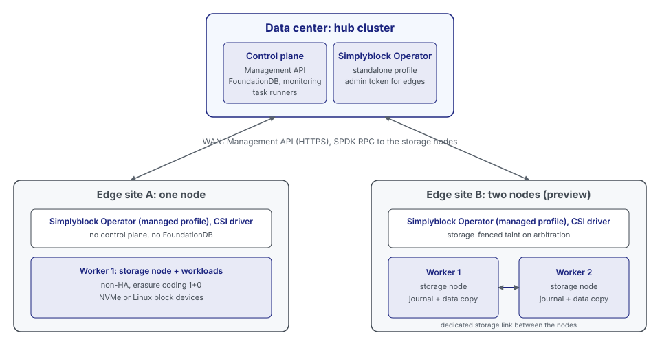

An edge cluster is a small simplyblock storage cluster at an edge site, such as a branch office, a factory, or a
store. It consists of one or two storage nodes on the Kubernetes cluster of the site. The edge cluster does not run a
control plane of its own. It is managed by a central simplyblock control plane on a hub cluster in the datacenter,
which can manage many edge clusters.

## Components

| Component                         | Runs on      | Role                                                                                                                       |
|-----------------------------------|--------------|----------------------------------------------------------------------------------------------------------------------------|
| Control plane                     | Hub cluster  | Holds the state of every edge storage cluster in FoundationDB, exposes the Management API, and orchestrates storage nodes. |
| Simplyblock Operator (standalone) | Hub cluster  | Installs and operates the control plane on the hub.                                                                        |
| Simplyblock Operator (managed)    | Edge cluster | Discovers workers and devices, creates the storage cluster through the hub, and maintains the CSI configuration.           |
| CSI driver                        | Edge cluster | Provisions and attaches volumes for the workloads of the site.                                                             |
| Storage nodes                     | Edge workers | Serve the volumes over NVMe-oF from local NVMe devices or Linux block devices.                                             |

The hub follows the centralized model described in [Control Plane and Operator](control-plane-and-operator.md). It
can be the same cluster that runs the simplyblock Disaster Recovery hub.

## Control and Data Flow

- **Edge to hub:** The operator at the edge reaches the Management API of the hub over HTTPS. It registers the storage
  cluster, creates its storage nodes and pools, and reads their state. It authenticates with a bearer token.
- **Hub to edge:** The control plane reaches every storage node of every edge on the storage node API and the storage
  node RPC ports. It configures and monitors the storage nodes and runs restarts and recovery.
- **Data path:** Volume I/O stays at the edge. Workloads reach the storage nodes of their own site over NVMe-oF.
  Volume data never crosses the WAN.

Storage at the edge keeps serving I/O while the WAN link to the hub is down. Management operations, such as creating
a volume, and automatic recovery actions of the control plane wait until the link is back.

## High Availability

### One-Node Edge Clusters

A one-node edge cluster has a single storage node and uses the erasure-coding scheme 1+0. It is not highly
available: if the node fails, its volumes are unavailable until the node is back. Applications that must survive the
loss of the node need a two-node edge cluster or application-level replication.

### Two-Node Edge Clusters

!!! note
    Two-node edge clusters require two-node arbitration support in the control plane, the Simplyblock Operator, and
    the storage nodes.

A two-node edge cluster uses the erasure-coding scheme 1+1 on exactly two storage nodes and keeps a copy of the
journal and the data on each node. Every volume has a primary on one node and a secondary on the other, and a
workload connects to both over two NVMe-oF paths. When a node fails, the other node takes over leadership, the active
path switches, and I/O continues after a short pause.

With only two nodes, a broken link between the nodes looks the same to each node as a failed peer. To prevent both
nodes from writing on their own (split brain), the control plane on the hub acts as the third vote:

- **Hold:** A node that loses the connection to the journal of its peer holds its write I/O for a short time
  (2.5 seconds by default, below the host keep-alive timeout) and reports the event to the hub.
- **Decision:** The hub decides which node continues. It grants that node solo operation and fences the other one.
  A fenced node returns the held I/O as a path error, so the hosts retry on the other path.
- **Leases:** Each node holds a lease from the hub. A lease only matters while a node holds I/O. A slow or broken
  link to the hub never fences a healthy pair.
- **Preferred node:** If neither node reaches the hub nor the other node, the preferred node continues after the hold
  time and the other node fences itself.
- **Workload restart:** The operator taints the Kubernetes node of a fenced storage node with
  `storage.simplyblock.io/fenced`, so that Kubernetes and KubeVirt restart the affected workloads on the other node.

## Network Paths

| Path                   | Between                        | Purpose                                                   | Required for           |
|------------------------|--------------------------------|-----------------------------------------------------------|------------------------|
| Management uplink      | Edge workers and the hub       | Management API, storage node API, storage node RPC        | All edge clusters      |
| Storage network        | Edge workers and their clients | NVMe-oF volume traffic                                    | All edge clusters      |
| Link between the nodes | The two storage nodes          | Journal and data replication, second path besides the hub | Two-node edge clusters |

For a two-node edge cluster, the link between the nodes and the management uplink must not share a switch, a cable,
or a network interface. Otherwise, a single failure cuts both paths at the same time, and the hub cannot tell a
failed node from a broken link.

The requirements are listed in [Edge Cluster Requirements](../../deployment-preparation/edge-requirements.md), the
deployment in [Deploying Edge Clusters](../../kubernetes/installation/edge-clusters.md), and the operation in
[Operating Edge Clusters](../../kubernetes/operations/cluster/edge-clusters.md).
