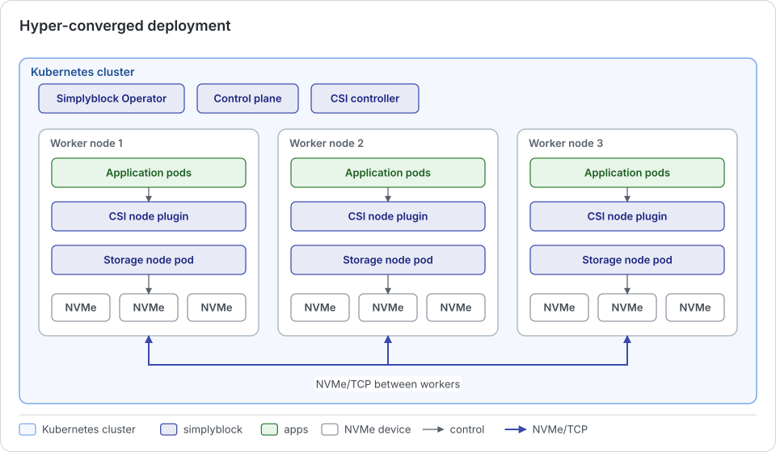

In a hyper-converged (HCI) deployment, compute, storage, and networking are integrated on the same nodes. Simplyblock
storage nodes run as pods on the same Kubernetes workers as the application workloads, and the local NVMe devices of
those workers form the distributed storage pool. Traditional storage architectures separate compute and storage into
distinct hardware layers with specialized hardware and management. Hyper-converged storage consolidates both on
standard servers and forms a software-defined storage layer that distributes and manages data across the cluster.

## How It Works

Every worker that contributes storage runs a simplyblock storage node pod next to the application pods and the CSI
node plugin. Volumes are distributed across all storage nodes of the cluster and accessed over NVMe/TCP or
NVMe/RoCE, both between workers and from a worker to its own storage node.

Simplyblock values data locality in hyper-converged deployments and implements dynamic data locality, in which the
front storage of a volume follows its workload to the node it runs on (see
[Volume Migration](../concepts/volume-migration.md)). However, data locality is always best-effort. It never limits
the scalability of individual volumes, storage pools, or clusters, and it never compromises a balanced resource
utilization.

## Benefits

- **Simplified hardware management and operations:** A single type and configuration of rack server and network
  setup scales to hundreds or thousands of units. No specialized storage hardware or storage fabric has to be fitted
  into the operations model, which improves the economies of scale from procurement to operations.
- **Cluster scalability:** Clusters scale from very small to very large without adjusting storage separately. New
  nodes add compute and storage capacity at the same time, and storage capacity and performance grow and shrink with
  the size of the cluster. This suits environments with unknown growth and a mix of sizes, from small edge clusters
  to large datacenter clusters.
- **Decoupling from the hardware lifecycle:** Individual components or nodes can be replaced, also with hardware from
  different vendors, without service interruption or degradation. Gradual replacement of hardware is supported.
- **Data locality:** Best-effort data locality reduces the load on the shared network and improves the latency and
  throughput of I/O.

## Considerations

- **Shared resources:** Storage nodes reserve CPU cores and huge-page memory on the workers they run on. These
  resources are not available to applications. See the hyper-converged notes in
  [Hardware Requirements](../../deployment-preparation/hardware-requirements.md#hyper-converged-sizing-guidance).
- **Coupled maintenance:** Worker maintenance, reboots, and upgrades also affect the storage node on that worker, so
  the maintenance of compute and storage has to be coordinated.
- **Coupled scaling:** Adding compute also adds storage and the other way round, which fits workloads whose storage
  needs grow with their compute needs.

## When to Choose HCI

A hyper-converged deployment is the preferred choice when:

- The cluster runs on uniform servers with local NVMe devices, and storage and compute grow together.
- The number of servers should be minimal, for example, in edge locations or small clusters.
- Latency-sensitive workloads benefit from data locality.
- One operations model for all nodes is preferred over a separate storage tier.

If storage and compute have to scale or be maintained independently, a
[disaggregated deployment](disaggregated.md) is the better fit. Both models can also be mixed within one cluster.
