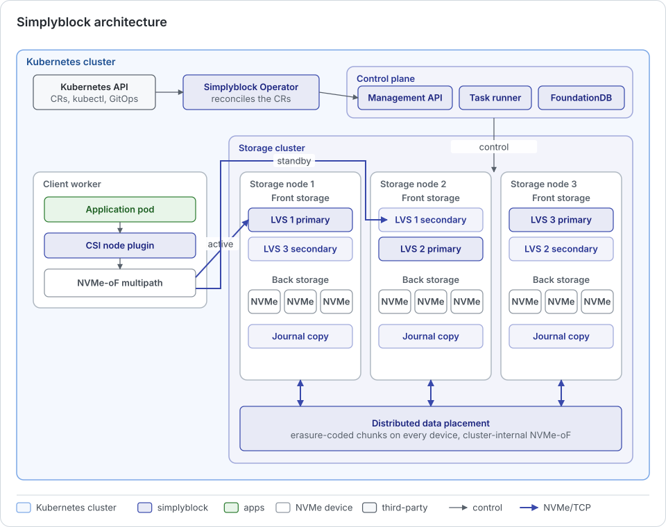

Simplyblock is a cloud-native, distributed block storage platform for Kubernetes. It pools the NVMe devices of many
storage nodes into one storage cluster and serves logical volumes over NVMe over Fabrics (NVMe/TCP or NVMe/RoCE).
The platform is deployed and operated entirely through Kubernetes: the Simplyblock Operator installs and manages
every component from custom resources, and workloads consume storage through the simplyblock CSI driver.

The architecture consists of four layers:

- **Simplyblock Operator:** The Kubernetes-native management layer that turns custom resources into a running
  storage platform.
- **Control plane:** The management API, the task runner, and the state database of one or more storage clusters.
- **CSI driver:** The interface between Kubernetes workloads and simplyblock volumes.
- **Storage plane:** The storage nodes, which serve all I/O. It is fully distributed and consists of a front
  storage layer and a back storage layer.

## Simplyblock Operator

The Simplyblock Operator is installed with a Helm chart and manages the full lifecycle of the platform through custom
resources of the API group `storage.simplyblock.io`. The chart renders two resources, and the operator creates
everything else from them:

- **`ControlPlane`:** The control plane, either installed by the operator in the same Kubernetes cluster (`local`)
  or running elsewhere and only connected (`managed`).
- **`SimplyblockDriver`:** The CSI driver, with its node plugin on every worker and its controller.

A storage cluster is described by a `ClusterDeploymentConfig`, which the operator drafts from a discovery of the
workers and their devices. Once approved, the operator creates the `StorageCluster`, one `StorageNode` per worker
and socket, the `StorageDevice` objects, a default `StoragePool` with its StorageClass, and activates the cluster.
Imperative operations, such as restarting a node, migrating a volume, or upgrading the control plane, are separate
custom resources of the `*Ops` kinds (for example, `StorageNodeOps` or `StorageClusterOps`). Each one runs a
tracked, abortable state machine and records its outcome in its status. Capacity metrics of clusters, nodes, pools,
devices, and volumes are served by a read-only aggregated API (`metrics.simplyblock.io`).

The operator talks to the control plane through its management API. It never accesses the storage nodes directly
for data operations. See [Install](../kubernetes/installation/index.md) for the installation flow and the
[Simplyblock Operator reference](../reference/operator/index.md) for all kinds.

## Control Plane

The control plane holds the state of the storage clusters, exposes the management API, runs health checks, collects
statistics, and executes long-running tasks. It performs no NVMe I/O itself. A single control plane can manage
several storage clusters.

On Kubernetes, the control plane runs as a set of pods, typically in the same Kubernetes cluster as the storage
nodes:

- **Management API:** A stateless API service with two replicas by default. The operator, the CSI driver, and the
  `{{ cliname }}` command line interface use it.
- **Task runner:** Asynchronous tasks, such as node addition, restarts, migrations, and backups, are queued in the
  database and executed by task runners. A stopped task runner defers work instead of losing it.
- **FoundationDB:** All state (topology, volume metadata, task queues) is stored in
  [FoundationDB](https://www.foundationdb.org/){:target="_blank" rel="noopener"}, a replicated, transactional
  key-value store. It is provisioned by the FoundationDB operator with three or five coordinators, depending on the
  configured redundancy mode.
- **Observability (optional):** Prometheus, Grafana, and Graylog with OpenSearch for a quick start. Larger
  deployments usually integrate their existing observability stack instead.

The control plane is not in the I/O path. Volumes keep serving I/O while it is unavailable, while management
operations and automated recovery wait until it returns. Communication with the storage nodes uses secured HTTPS
endpoints: the storage node API for node control (availability, restart, shutdown) and a JSON-RPC interface for
storage configuration.

The control plane and the operator can run locally in every Kubernetes cluster or, in the future, centrally on a hub
cluster (see [Control Plane and Operator](deployment-topologies/control-plane-and-operator.md)). Details of the
components are in [Control Plane Cluster Architecture](../kubernetes/installation/management-cluster-architecture.md).

## CSI Driver

The simplyblock CSI driver implements the Kubernetes Container Storage Interface. Its controller creates, resizes,
snapshots, clones, and deletes volumes through the management API. Its node plugin connects a volume to the worker
of the consuming pod over NVMe-oF, with one path to every storage node that serves the volume, and mounts it into the
pod. Workloads use standard Kubernetes objects: StorageClass, PersistentVolumeClaim, and VolumeSnapshot.

## Storage Plane

The storage plane consists of storage nodes. A storage node is a pod on a Kubernetes worker that takes over one or
more NVMe devices of that worker. By default, one storage node runs per worker, and larger workers can run one or
more storage nodes per CPU socket. The storage nodes of a storage cluster together form one distributed system with
two separately distributed layers: the front storage and the back storage.

### Front Storage

The front storage is the layer that clients connect to. It holds the logical volumes, their snapshots, and clones.

- **Logical volume stores:** Every storage node owns a logical volume store, in which the logical volumes of that
  node are created. Each volume store is replicated to a secondary node and, with two parity chunks, also to a
  tertiary node. Primary, secondary, and tertiary always run on different hosts and, with
  [failure domains](concepts/failure-domains.md), in different failure domains wherever possible.
- **NVMe-oF subsystems:** Each logical volume is exposed as an NVMe namespace of an NVMe-oF subsystem on its primary,
  secondary, and tertiary node. The client sees one device with several paths. The path to the primary is active,
  and the others are standby paths (NVMe asymmetric namespace access, ANA). If the primary fails, the client's
  NVMe multipathing switches to the secondary within seconds, without any intervention.
- **High-availability write journal:** Writes are recorded in a distributed journal with several copies on
  different nodes, so that a failover continues on a consistent state.
- **Instant volume migration:** Because the front storage is separate from the data layout, a logical volume can
  be moved to another storage node almost instantly, without copying data. This is what lets a volume follow its
  workload (see [Volume Migration](concepts/volume-migration.md)).

### Back Storage

The back storage is the layer that stores the data on the NVMe devices.

- **Distributed data placement:** Data written to a logical volume is split into chunks and distributed across all
  devices of all storage nodes in the cluster. Every front storage entry point can reach every back storage device
  over cluster-internal NVMe-oF. Access to a volume is therefore parallelized across many nodes and devices, and the
  capacity and performance of the whole cluster are available to every volume.
- **Distributed erasure coding:** Every stripe of data chunks is protected by parity chunks (for example, `2+1` or
  `4+2`) that are placed on other nodes than the data chunks. The fault tolerance is therefore defined in terms of
  whole storage nodes that can fail, not only devices (see
  [Erasure Coding](concepts/erasure-coding.md)).
- **Balanced by default:** Data is placed to keep the utilization of all devices equal relative to their capacity.
  After failures, expansions, or node removals, the cluster rebalances in the background with a bounded share of its
  performance (see [Automatic Rebalancing](concepts/automatic-rebalancing.md)). Co-locating data with its front
  storage is optional (see [Data Locality](storage-performance-and-qos.md#data-locality)).

### Storage Node Internals

The data plane of a storage node is built on a fork of SPDK (Storage Performance Development Kit) and DPDK (Data Plane
Development Kit). Simplyblock detaches the NVMe devices from the Linux kernel and handles all communication with the
hardware in user space. This removes transitions between user space and kernel, reduces context switches, and keeps
the latency low. Storage nodes use dedicated CPU cores and huge-page memory (see
[Hardware Requirements](../deployment-preparation/hardware-requirements.md)).

## Placement Models

Storage nodes can run on the same workers as the applications (hyper-converged), on dedicated workers of the same
Kubernetes cluster (disaggregated), or in a mix of both. The architecture is the same in all models. Only the
selection of the workers that run storage nodes differs. See [Deployment Topologies](deployment-topologies/index.md).

## Data Protection and Security

- **Erasure coding and failover:** Data survives the loss of as many storage nodes as the erasure coding scheme has
  parity chunks, and the NVMe-oF multipathing keeps volumes available through the same number of node failures (see
  [High Availability and Fault Tolerance](high-availability-fault-tolerance.md)).
- **Encryption at rest:** Volumes can be encrypted with AES-XTS at the volume level, with keys held in an external
  key management system (see [External Key Management](concepts/external-key-management.md)).
- **Transport security:** Hosts can be authenticated with DH-HMAC-CHAP, and the transport can be secured with TLS
  (see [NVMe over Fabrics Security](concepts/nvmf-security.md)).
- **Multi-tenancy:** Storage pools separate tenants with their own limits and defaults.
- **Snapshots, backups, and disaster recovery:** Copy-on-write snapshots and clones, backups to S3, and
  replication between clusters are the basis for [Disaster Recovery](../disaster-recovery/index.md).

## Technologies in Simplyblock

Simplyblock builds on a set of open-source technologies.

| Component        | Technologies                                                                                                                                                                                                                                                                                             |
|------------------|----------------------------------------------------------------------------------------------------------------------------------------------------------------------------------------------------------------------------------------------------------------------------------------------------------|
| Networking       | [NVMe-oF](https://nvmexpress.org/){:target="_blank" rel="noopener"}, [NVMe/TCP](../important-notes/terminology.md#nvmetcp-nvme-over-tcp), [NVMe/RoCE](../important-notes/terminology.md#nvmeroce-nvme-over-rdma-over-converged-ethernet), [DPDK](https://www.dpdk.org/){:target="_blank" rel="noopener"} |
| Storage          | [SPDK](https://spdk.io/){:target="_blank" rel="noopener"}, [FoundationDB](https://www.foundationdb.org/){:target="_blank" rel="noopener"}                                                                                                                                                                |
| Kubernetes       | [Kubernetes CSI](https://kubernetes-csi.github.io/docs/){:target="_blank" rel="noopener"}, [FoundationDB Operator](https://github.com/FoundationDB/fdb-kubernetes-operator){:target="_blank" rel="noopener"}                                                                                             |
| Observability    | [Prometheus](https://prometheus.io/){:target="_blank" rel="noopener"}, [Grafana](https://grafana.com/){:target="_blank" rel="noopener"}                                                                                                                                                                  |
| Logging          | [Graylog](https://graylog.org/){:target="_blank" rel="noopener"}, [OpenSearch](https://opensearch.org/){:target="_blank" rel="noopener"}, [MongoDB](https://www.mongodb.com/){:target="_blank" rel="noopener"}                                                                                           |
| Operating System | [Linux](https://www.kernel.org/){:target="_blank" rel="noopener"}                                                                                                                                                                                                                                        |
