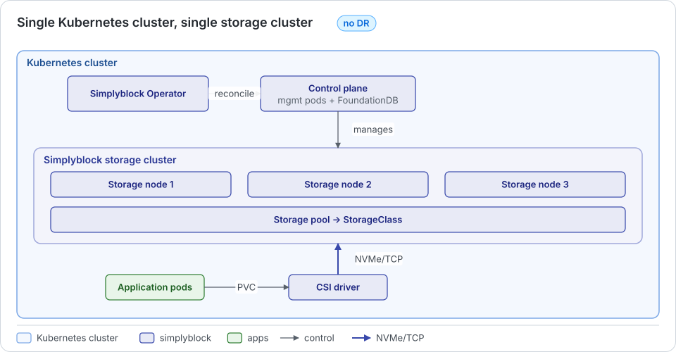
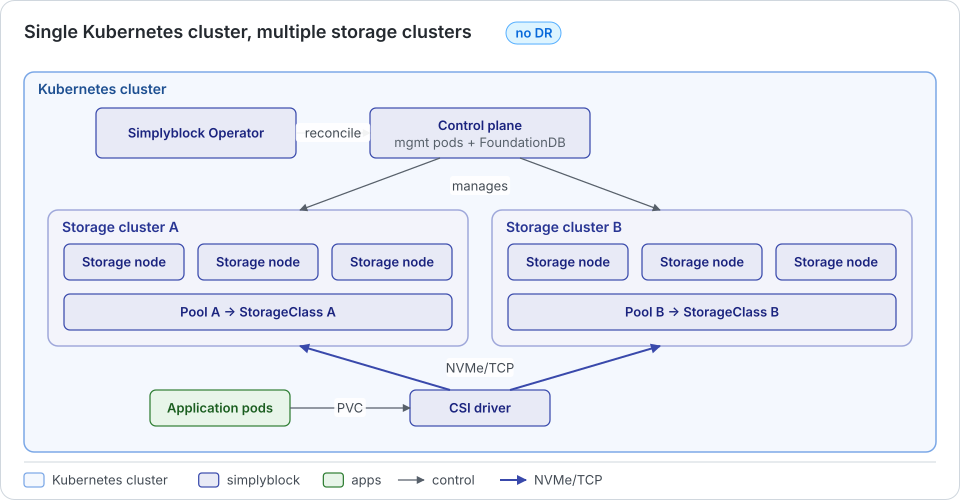
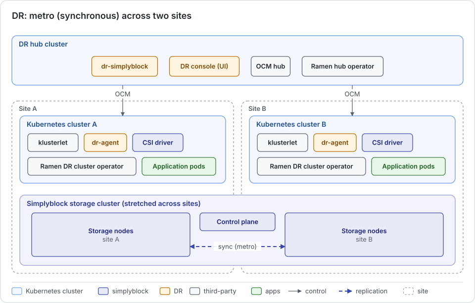
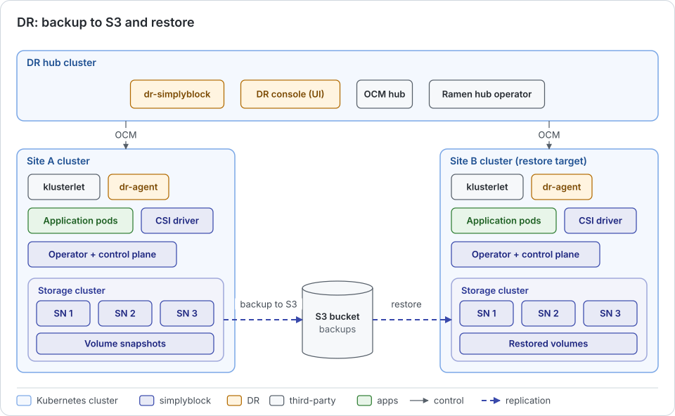
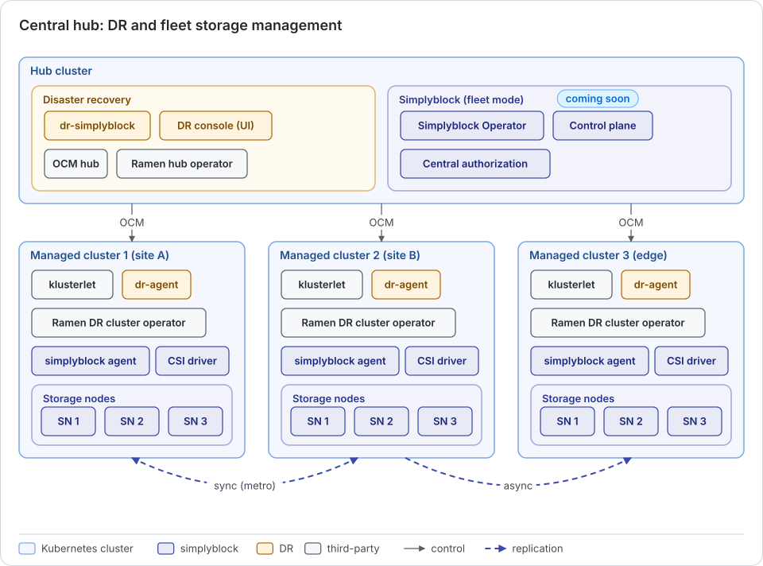

A simplyblock deployment architecture defines how many Kubernetes clusters and storage clusters are involved, where
the control plane and the Simplyblock Operator run, and whether a hub cluster coordinates disaster recovery (DR)
between sites. This page describes the supported architectures, from a single cluster without DR to a central hub
that manages DR and storage for several clusters, and ends with a decision table. The placement of storage nodes
within a cluster (hyper-converged, disaggregated, or hybrid) is independent of the architecture and is described in
[Deployment Topologies](../architecture/deployment-topologies/index.md).

## Overview

| Architecture                                         | Kubernetes clusters      | Storage clusters               | Hub cluster         | DR            |
|------------------------------------------------------|--------------------------|--------------------------------|---------------------|---------------|
| Single Kubernetes cluster, single storage cluster    | 1                        | 1                              | No                  | No            |
| Single Kubernetes cluster, multiple storage clusters | 1                        | 2 or more                      | No                  | No            |
| DR hub with local storage: metro                     | 1 hub + 2 sites          | 1, stretched across both sites | Yes, DR only        | `sync`        |
| DR hub with local storage: async                     | 1 hub + 2 or more sites  | 1 per site                     | Yes, DR only        | `async`       |
| DR hub with local storage: backup                    | 1 hub + 1 or more sites  | 1 per site                     | Yes, DR only        | `snapshot-s3` |
| Central hub for DR and storage (coming soon)         | 1 hub + managed clusters | 1 or more per managed cluster  | Yes, DR and storage | All           |

## Single Kubernetes Cluster, Single Storage Cluster

All components run in one Kubernetes cluster: the Simplyblock Operator, the control plane (management pods and
FoundationDB), the CSI driver, and the storage nodes of one storage cluster. The storage cluster provides a storage
pool that is exposed through one or more storage classes.

The architecture has the following properties.

- **When to use:** A single site or availability zone, where one storage cluster covers the capacity and
  performance needs. This is the most common starting point.
- **Components:** Operator, control plane, CSI driver, and storage nodes in the same Kubernetes cluster. Storage
  nodes run hyper-converged, disaggregated on dedicated workers, or both.
- **Failure behavior:** Node, device, and network path failures are handled within the cluster by erasure coding
  and NVMe-oF multipathing. With [failure domains](../architecture/concepts/failure-domains.md), the loss of a whole
  rack or zone can be tolerated. The loss of the entire cluster or site is not covered.
- **Replication types:** No cross-site replication. Volume backups to S3 with the simplyblock
  [Backup and Recovery](../kubernetes/operations/data-protection/backup-recovery.md) resources protect against the
  loss of the cluster, with a restore into a new cluster.

## Single Kubernetes Cluster, Multiple Storage Clusters

One Kubernetes cluster runs one control plane and one operator, which manage several independent storage clusters.
Each storage cluster has its own storage nodes, its own pools, and its own storage classes.

The architecture has the following properties.

- **When to use:** Workloads that need separate failure or performance isolation, different hardware classes (for
  example, a high-performance and a capacity tier), different erasure coding schemes, or separation between tenants
  within one Kubernetes cluster.
- **Components:** One operator, one control plane, and the CSI driver in the Kubernetes cluster. The storage nodes of
  each storage cluster run on their own set of workers.
- **Failure behavior:** A failure in one storage cluster affects only the volumes of that cluster. The control plane
  is shared, so its availability matters for all storage clusters.
- **Replication types:** Storage-level [asynchronous replication](../kubernetes/operations/data-protection/asynchronous-replication.md)
  between the storage clusters and backups to S3. Since both storage clusters live in the same Kubernetes cluster,
  this protects against the loss of a storage cluster but not against the loss of the Kubernetes cluster or the
  site.

## DR Hub with Local Storage

For disaster recovery across sites, a separate hub cluster runs simplyblock Disaster Recovery: the Open Cluster
Management (OCM) hub, the Ramen hub operator, and dr-hub. Every site is its own Kubernetes cluster. The simplyblock
storage clusters, their operators, and their control planes run locally at the sites, not on the hub. The hub holds the DR configuration (protection plans, DR paths, and protected
applications) and drives failover, relocation, and tests. It never serves storage and never holds a kubeconfig of a
site.

Components common to all three variants:

- **Hub cluster:** OCM hub, Ramen hub operator, dr-hub, and optionally the DR console.
- **Site clusters:** OCM klusterlet, dr-agent, Ramen DR cluster operator, Velero, csi-addons, the snapshot
  controller, the simplyblock CSI driver, and the applications. dr-hub delivers the DR software stack to every site
  after it joins.
- **S3:** One bucket per site for Ramen metadata and Velero backups, and an archive bucket for reports and hub state
  bundles.

If the hub fails, protected applications keep running and replicating, but no DR action can be started until the hub
is available again or has been rebuilt. See [Hub Recovery](../disaster-recovery/operations/hub-recovery.md). The
requirements for the hub and the sites are listed in [Disaster Recovery Requirements](dr-requirements.md).

### Metro: Stretched Storage Cluster with Synchronous Replication

One simplyblock storage cluster is stretched across two sites in metro distance. Its storage nodes are split between
the sites, and each site is represented by its own failure domains, so that every stripe has chunks at both sites.
Each site runs its own Kubernetes cluster for the applications, and both consume the same storage cluster. A
protection plan with a `sync` method gives both sites the same storage identity.

The architecture has the following properties.

- **When to use:** Two datacenters or availability zones with low latency between them, where no data may be lost
  on the loss of a site (RPO of zero).
- **Components:** Hub cluster, two site Kubernetes clusters with the DR site stack, and one stretched storage
  cluster with storage nodes at both sites. The control plane of the stretched storage cluster must be placed so
  that it keeps its quorum when one site is lost.
- **Failure behavior:** On the loss of one site, the storage cluster continues serving I/O from the other site, as
  long as the failure domains of the lost site fit within the parity budget of the erasure coding scheme. For
  example, two failure domains per site with two parity chunks tolerate the loss of two whole domains. The
  applications are then moved to the surviving site with an unplanned failover, without data loss.
- **Replication types:** `sync`, optionally combined with `snapshot-s3`.

!!! warning
    Every write crosses the link between the sites, so the latency between the sites adds to the write latency of
    every volume. The failure-domain rules, including the minimum number of domains for activation, are described in
    [Failure Domains](../architecture/concepts/failure-domains.md). Unplanned failover with metro fencing is still
    behind a feature gate, see [Failover](../architecture/concepts/failover.md#fencing-for-metro-dr).

### Async: Separate Site Clusters with Asynchronous Replication

Every site runs its own Kubernetes cluster with its own storage cluster. The volumes of protected applications are
replicated from the source site to the target site at a fixed scheduling interval, and the Kubernetes objects are
captured by Velero into the site's S3 bucket.

The architecture has the following properties.

- **When to use:** Sites in different regions or at distances where synchronous replication is not practical, and
  where a recovery point of minutes is acceptable.
- **Components:** Hub cluster and two or more site clusters, each with the Simplyblock Operator, the CSI driver, its
  own storage cluster, and the DR site stack.
- **Failure behavior:** On the loss of a site, the applications are failed over to their target site. Data written
  after the last completed replication cycle is lost, which is roughly up to one scheduling interval. Planned moves
  (relocations) and failbacks lose no data. A third site can be added as a one-way fallback target.
- **Replication types:** `async`, optionally combined with `snapshot-s3`.

!!! note
    The storage-level replication between the storage clusters is provided by simplyblock
    [asynchronous replication](../kubernetes/operations/data-protection/asynchronous-replication.md). Its
    prerequisites, such as network connectivity between the storage clusters and the control plane both storage
    clusters are attached to, apply to this architecture as well.

### Backup: Backup and Restore via S3

Application objects and volume records are backed up to S3 on a cron schedule. This protects against the case where
the hub and all sites are lost, for example, after a ransomware attack, and only the object storage remains.

The architecture has the following properties.

- **When to use:** As a last line of defense in addition to `sync` or `async` replication, or as the only protection
  where a recovery point of one backup interval and a longer restore time are acceptable.
- **Components:** Hub cluster, one or more site clusters, and S3 buckets per site. The buckets should use versioning
  and object lock.
- **Failure behavior:** After the loss of everything, the hub is restored from its state bundle, the rebuilt sites
  rejoin, and each application is restored onto its rebuilt source site. Data written after the last complete backup
  is lost.
- **Replication types:** `snapshot-s3`. Volume-level backups of simplyblock itself are described in
  [Backup and Recovery](../kubernetes/operations/data-protection/backup-recovery.md).

## Central Hub for DR and Storage

!!! info "Coming soon"
    The hub deployment of the Simplyblock Operator and control plane is not released yet. Today, the hub runs the DR
    components only, and the simplyblock operators and control planes run at the sites (see
    [DR Hub with Local Storage](#dr-hub-with-local-storage)).

    In this architecture, one hub cluster runs both the DR components and the centralized simplyblock operator and
    control plane. The managed clusters run the OCM klusterlet, dr-agent, the Ramen DR cluster operator,
    lightweight simplyblock agents, the CSI driver, and the storage nodes. Storage and DR are then managed and
    authorized in one place.

    

    The architecture has the following properties.

    - **When to use:** Many small clusters, for example, edge locations, that should be managed centrally and keep a
      minimal footprint.
    - **Components:** Hub cluster with OCM hub, Ramen hub operator, dr-hub, DR console, simplyblock operator, and
      control plane. Managed clusters with agents, CSI driver, and storage nodes.
    - **Failure behavior:** While the hub is unavailable, neither storage management nor DR actions are possible, so
      the hub has to be highly available and its state recoverable.
    - **Replication types:** `sync`, `async`, and `snapshot-s3`, depending on the protection plans.

    The management model is described in
    [Control Plane and Operator](../architecture/deployment-topologies/control-plane-and-operator.md).

## Decision Table

| Requirement                                                                              | Recommended architecture                                               |
|------------------------------------------------------------------------------------------|------------------------------------------------------------------------|
| One site, one storage tier                                                               | Single Kubernetes cluster, single storage cluster                      |
| One site, several isolated storage tiers or tenants                                      | Single Kubernetes cluster, multiple storage clusters                   |
| Protection against loss of the cluster, recovery point of one backup interval acceptable | Single cluster plus simplyblock backups to S3                          |
| Two sites at metro distance, no data loss on site loss                                   | DR hub with metro (stretched storage cluster, `sync`)                  |
| Sites in different regions, recovery point of minutes                                    | DR hub with async (separate site clusters, `async`)                    |
| Recovery from loss of all clusters or ransomware                                         | Add `snapshot-s3` backups to a metro or async plan                     |
| Many small or edge clusters, central management                                          | Central hub for DR and storage (coming soon)                           |
| Strict isolation between clusters, independent upgrades                                  | Local control plane and operator per cluster, with or without a DR hub |
