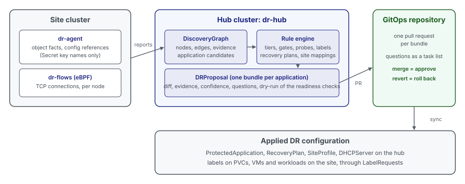

Protecting an application by hand means choosing its namespaces and volumes, writing tiers with readiness gates and
health probes, ordering it against other applications in a recovery plan and binding the site networks. Discovery
does this work from what the sites report. It builds a dependency graph of every site, finds the applications in it
and proposes the complete protection setup of each application as one bundle. A person approves every bundle before
anything changes.

## What Is Discovered

- **Membership:** Which VMs, Deployments, StatefulSets and PVCs belong to one application. Membership is derived from
  ownership, volume mounts, Service selectors, configuration references and observed network connections. It does not
  rely on labels set in advance.
- **Dependencies:** Which workload uses which Service, inside an application and between applications. The order of
  the tiers and the priorities of a recovery plan follow from them.
- **Roles:** Known images, such as databases and message queues, are recognized and placed early in the boot order.
- **Site mappings:** The networks of VMs, their subnets and the DHCP servers on them, for the site profiles.

## Bundles

A bundle is a DRProposal object on the hub. It holds everything needed to protect one application:

- The ProtectedApplication with namespaces, PVC selector, tiers, readiness gates, and health probes.
- The labels to set on the application's PVCs, VMs, and workloads, so that the selectors match.
- The place of the application in a recovery plan, as a separate RecoveryPlan bundle per DR path.
- Site-mapping changes, as a separate SiteMapping bundle per site.

Every proposed value carries its evidence (the graph edges it rests on) and a confidence. Values that cannot be
decided become questions. Before approval, dr-hub evaluates the readiness checks against the proposed objects (a
dry run) and attaches the result to the bundle.

## Approval

Nothing is applied without approval, and a whole application is approved at once.

- **With a GitOps repository:** Each bundle becomes a pull request. Merging the pull request approves the bundle, the
  GitOps tool of the hub applies it, and reverting the commit rolls it back.
- **Without a GitOps repository:** Bundles are approved and rolled back in the Control Center by a user with the
  `dr-admin` role.

## Rules and AI

Discovery runs in rules mode: a deterministic rule engine produces a complete baseline from the graph without any
model. An AI mode, which refines bundles with a Claude agent through an MCP server, is planned and not implemented
yet. A DiscoveryRun in mode `AI` fails with the reason `NotImplemented`.

## In This Section

- **[Setup](setup.md):** Enabling discovery, the flow collector, the GitOps target and the roles.
- **[Using Discovery](using-discovery.md):** Running discovery, reading the graph, reviewing, approving, and rolling back
  bundles.
- **[Reference](reference.md):** Bundle phases, configuration fields, run fields, annotations, and label keys.
