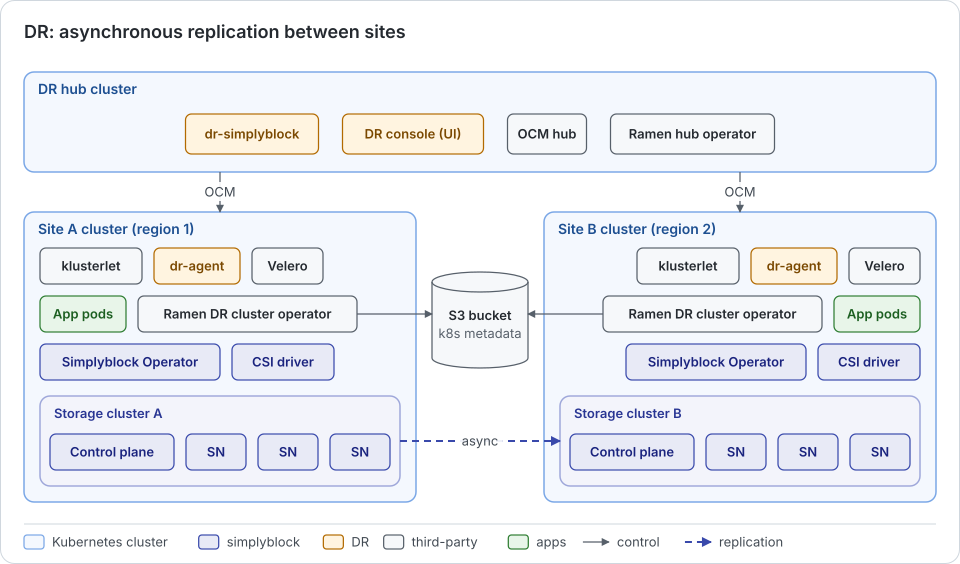

simplyblock Disaster Recovery (dr-simplyblock) protects Kubernetes applications (containers and KubeVirt virtual
machines) that store their data on simplyblock. It replicates an application's volumes and Kubernetes objects from
one site to another. It moves the application between sites on request (planned or unplanned), rehearses that move
in an isolated test bubble, and keeps backups in S3 for the case where every cluster is lost. All of it is
declared as Kubernetes custom resources in the API group `dr.simplyblock.io/v1alpha1` on a central hub cluster.

## Building Blocks

A simplyblock DR deployment consists of one hub cluster and two or more site clusters. The hub holds the DR
configuration and drives every action. The sites run the applications and the simplyblock storage.

- **Hub cluster:** Runs dr-hub, the Open Cluster Management (OCM) hub, and the Ramen hub operator. The hub never
  holds a kubeconfig of a site. It reaches the sites only through OCM.
- **Site clusters:** Run the OCM klusterlet, dr-agent, the Ramen DR cluster operator, Velero, csi-addons, and
  simplyblock with its CSI driver. dr-hub delivers the site software stack (snapshot controller, csi-addons, Recipe
  CRD, Velero, Ramen DR cluster operator) to every joined site.
- **Open Cluster Management (OCM):** Registers the sites with the hub and carries all traffic between them. The hub
  sends work to a site as ManifestWorks and reads status back through ManagedClusterViews.
- **Ramen:** Orchestrates volume replication, protection of Kubernetes objects, and the promotion of volumes on the
  target site during a failover or relocation.
- **Velero:** Captures and restores an application's Kubernetes objects and runs the snapshot-s3 backups.
- **Hub controller (dr-hub):** The simplyblock DR controller on the hub. It derives the Ramen and csi-addons objects from the
  simplyblock DR resources, computes readiness, runs recovery actions and tests, and writes reports and signed state
  bundles to S3.
- **Site agent (dr-agent):** The simplyblock DR agent on each site, installed as an OCM addon. It reports status to the hub and
  runs the site-side steps: hooks, health probes, test bubbles, cleanup, and backups.

The concepts behind these objects are described in
[Protection Plans](../architecture/concepts/dr-protection-plans.md),
[Protected Applications](../architecture/concepts/dr-applications.md),
[Failover](../architecture/concepts/failover.md), and [Relocation](../architecture/concepts/relocation.md). The
supported topologies are shown in [Deployment Architectures](../deployment-preparation/deployment-architectures.md).

## Replication Types

A protection plan declares one or more replication methods. Each protected application uses one of them.

| Type          | Also known as | How it works                                                                            | Data loss on unplanned failover |
|---------------|---------------|-----------------------------------------------------------------------------------------|---------------------------------|
| `sync`        | Metro DR      | Volumes are written synchronously to both sites. Both sites share one storage identity. | None while in sync              |
| `async`       | Regional DR   | Volumes are replicated at a fixed `schedulingInterval`, for example, every 5 minutes.   | Up to about one interval        |
| `snapshot-s3` | Backup        | Application objects and volume records are backed up to S3 on a cron schedule.          | Up to one backup interval       |

A plan cannot mix `sync` and `async`. A `snapshot-s3` method runs alongside either. Details are in
[Replication Types](configuration/replication-types.md).

## Lifecycle

Protecting an application follows four stages:

1. **Install:** Set up the hub cluster and its archive bucket, then join the site clusters. See
   [Install](install/index.md).
2. **Configure:** Declare protection plans, the directed DR paths between sites, and the protected applications with
   their boot order and hooks. See [Configuration](configuration/index.md).
3. **Test:** Rehearse a failover in an isolated bubble on the target site, on demand or on a schedule. See
   [Test](testing/index.md).
4. **Operate:** Monitor readiness, fail over, fail back, and restore from backups or after
   the loss of the hub. See [Operations](operations/index.md).

The hub and site requirements are listed in [DR Requirements](../deployment-preparation/dr-requirements.md).

## Available Today and Coming Soon

The following capabilities are available today:

- **Protection:** Protection plans with sync, async, and snapshot-s3 methods, directed DR paths, and protected
  applications (discovered and managed).
- **Boot order:** Tiers with readiness gates, turned into Ramen Recipes by dr-hub.
- **Recovery actions:** Failover, Relocate, and failback, for single applications and for ordered recovery plans,
  with pre-flight readiness checks, external hooks, health probes, and reports.
- **Test failover:** Isolated test bubbles and test schedules for discovered applications.
- **Backup and restore:** snapshot-s3 backups and restore onto rebuilt sites.
- **Hub recovery:** Signed DR state bundles and the `dr-restore` command-line tool.

!!! info "Coming soon"
    - **Site mapper:** Rewriting of network attachments, storage classes, zones, addresses, and routes between sites.
      Until then, an application recovers exactly as captured, so both sites need identical names for these objects.
    - **Hub restore action:** A `RestoreHub` recovery action on a running hub (the `dr-restore` tool covers this today).
    - **Hosted-cluster tests:** Test failovers inside a hosted cluster with mirrored networks.
    - **Online relocation:** Moving running workloads between sites without a restart. See
      [Relocate (Online)](operations/relocate-online.md).

## Section Contents

- [Install](install/index.md)
- [Configuration](configuration/index.md)
- [Test](testing/index.md)
- [Operations](operations/index.md)
