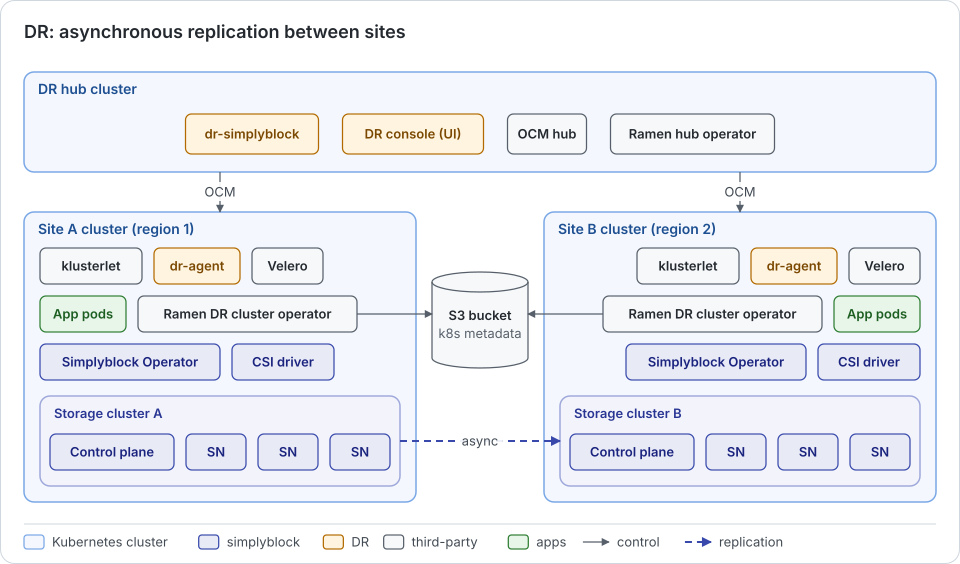

simplyblock Disaster Recovery (dr-simplyblock) protects Kubernetes applications (containers and KubeVirt virtual
machines) that store their data on simplyblock. It replicates an application's volumes and Kubernetes objects from
one site to another. It moves the application between sites on request (planned or unplanned), rehearses that move
in an isolated test bubble, and keeps backups in S3 for the case where every cluster is lost. All of it is
declared as Kubernetes custom resources in the API group `dr.simplyblock.io/v1alpha1` on a central hub cluster.

## Building Blocks

A simplyblock DR deployment consists of one hub cluster and two or more site clusters. The hub holds the DR
configuration and drives every action. The sites run the applications and the simplyblock storage.

- **Hub cluster:** Runs dr-hub, the Open Cluster Management (OCM) hub, and the Ramen hub operator. The hub never
  holds a kubeconfig of a site.
- **Site clusters:** Run the OCM klusterlet, dr-agent, the Ramen DR cluster operator, Velero, and simplyblock with
  its CSI driver, snapshot controller, and csi-addons. dr-hub installs the site software stack (Recipe CRD, Velero,
  Ramen DR cluster operator) on every joined site.
- **Open Cluster Management (OCM):** Registers the sites with the hub and carries all traffic between them.
- **Ramen:** Orchestrates volume replication, protection of Kubernetes objects, and the promotion of volumes on the
  target site during a failover or relocation.
- **Velero:** Captures and restores an application's Kubernetes objects and runs the snapshot-s3 backups.
- **Hub controller (dr-hub):** The simplyblock DR controller on the hub. It computes readiness, runs recovery actions
  and tests, and writes reports and signed state bundles to S3.
- **Site agent (dr-agent):** The simplyblock DR agent on each site, installed as an OCM addon. It reports status and
  the site's inventory to the hub and runs the site-side steps: hooks, health probes, test bubbles, cleanup, zone
  moves, and restarts.
- **Control Center:** The simplyblock web console, with a Disaster recovery section that configures and operates
  all of the above in the browser. See [Control Center](control-center.md).

The concepts behind these objects are described in
[Protection Plans](../architecture/concepts/dr-protection-plans.md),
[Protected Applications](../architecture/concepts/dr-applications.md),
[Failover](../architecture/concepts/failover.md), and [Relocation](../architecture/concepts/relocation.md). The
supported topologies are shown in [Deployment Architectures](../deployment-preparation/deployment-architectures.md).

## Replication Types

A protection plan declares one or more replication methods. Each protected application uses one of them.

| Type              | Also known as | How it works                                                                                               | Data loss on unplanned failover |
|-------------------|---------------|------------------------------------------------------------------------------------------------------------|---------------------------------|
| `sync`            | Metro DR      | A stretch cluster writes every block to both zones of one cluster. The sites are its zones.                | None                            |
| `async`           | Regional DR   | Volumes are replicated between two clusters at a fixed `schedulingInterval`, for example, every 5 minutes. | Up to about one interval        |
| `s3-backup`       | Vault         | Every primary volume is backed up to S3 at an interval. The peer promotes from the newest backup.          | Up to one backup interval       |
| `sync-s3-backup`  |               | `sync` with backups to S3.                                                                                 | None                            |
| `async-s3-backup` |               | `async` with backups to S3.                                                                                | Up to about one interval        |

A plan cannot mix synchronous and asynchronous types, and every application uses exactly one method. Details are in
[Replication Types](configuration/replication-types.md).

DR uses two kinds of S3 buckets: the DR metadata buckets of the sites for the Kubernetes objects of protected
applications and the volume backups of the backup method types, and an archive bucket for the hub state and the
reports. See [S3 Buckets](../deployment-preparation/dr-requirements.md#s3-buckets).

## Lifecycle

Protecting an application follows four stages:

1. **Install:** Set up the hub cluster and its archive bucket, then join the site clusters. See
   [Install](install/index.md).
2. **Configure:** Declare protection plans, the directed DR paths between sites, and the protected applications with
   their boot order and hooks. See [Configuration](configuration/index.md).
3. **Test:** Rehearse a failover in an isolated bubble on the target site, on demand or on a schedule. See
   [Test](testing/index.md).
4. **Operate:** Monitor readiness, fail over, fail back, and restore from backups or after
   the loss of the hub. See [Operations](operations/index.md).

The hub and site requirements are listed in [DR Requirements](../deployment-preparation/dr-requirements.md).

## Available Today and Coming Soon

The following capabilities are available today:

- **Protection:** Protection plans with the five method types, directed DR paths, and protected applications
  (discovered and managed). Asynchronous replication runs on the simplyblock CSI driver's csi-addons replication,
  with the backend pairing derived by dr-hub.
- **Boot order:** Tiers with readiness gates, including `exec` gates.
- **Recovery actions:** Failover, Relocate, and failback, for single applications and for ordered recovery plans,
  with pre-flight readiness checks, external hooks, health probes, and reports. Restart in place after a storage
  recovery.
- **Site mapper:** Site profiles, DHCP servers, and the mapping of the network attachments and guest addresses of
  virtual machines between sites.
- **Test failover:** Isolated test bubbles, with the storage operator's clones, and test schedules for discovered
  applications.
- **Backup and restore:** Backups by the storage with the backup method types, and restore onto rebuilt sites.
- **Hub recovery:** Signed DR state bundles and the `dr-restore` command-line tool.
- **Control Center:** The Disaster recovery section of the simplyblock web console.

!!! info "Coming soon"
    - **Site mapper, further categories:** Storage classes, zones, load balancer addresses, domains, routes, and
      literal values. Until then, these must carry identical names on both sites.
    - **Hub restore action:** A `RestoreHub` recovery action on a running hub (the `dr-restore` tool covers this today).
    - **Hosted-cluster tests:** Test failovers inside a hosted cluster with mirrored networks.
    - **Online relocation:** Moving running workloads between sites without a restart. See
      [Relocate (Online)](operations/relocate-online.md).
    - **Storage deployment from the hub console:** Discovering and deploying a managed site's storage cluster from
      the Control Center. See [Control Center](control-center.md).

## Section Contents

- [Install](install/index.md)
- [Configuration](configuration/index.md)
- [Test](testing/index.md)
- [Operations](operations/index.md)
- [Control Center](control-center.md)
