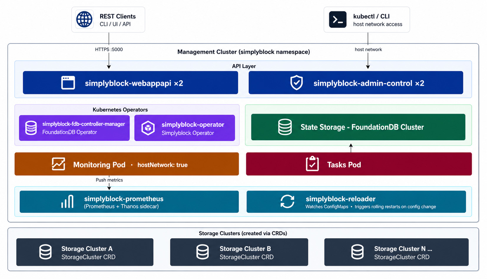

Simplyblock uses a **two-tier model**: a **control plane** holds all state, exposes the Management API, runs health
checks, collects metrics, and executes administrative tasks, while one or more **storage clusters** run the storage
nodes that serve NVMe-oF I/O. The control plane performs no NVMe I/O itself.

On Kubernetes, the control plane is described by a single `ControlPlane` resource named `simplyblock` in the
operator's namespace. The Helm chart creates it, and the operator reconciles it. No storage resource is reconciled
before the control plane reports the phase `Available`.

## Local and Managed Control Planes

`ControlPlane.spec.source` contains exactly one of two members. The choice is made at installation with the Helm value
`deployment.profile` and is immutable afterward.

- **`local` (Helm profile `standalone`):** The operator installs the control plane in this Kubernetes cluster:
  FoundationDB, the object store, and the management API with its companion services.
- **`managed` (Helm profile `managed`):** The control plane runs elsewhere. The operator installs nothing, only
  resolves and probes `spec.source.managed.endpoint` with the optional `credentialsSecretRef` and
  `caBundleSecretRef`, and reports the result. `ControlPlaneOps` actions are rejected for a managed control plane.
  See [Connecting to an External Control Plane](install-csi.md).

```yaml title="ControlPlane as rendered by the Helm chart (standalone profile)"
apiVersion: storage.simplyblock.io/v1alpha2
kind: ControlPlane
metadata:
  name: simplyblock
  namespace: simplyblock
  annotations:
    helm.sh/resource-policy: keep
spec:
  source:
    local:
      image: "quay.io/simplyblock-io/simplyblock:<version>"
      imagePullPolicy: Always
      foundationDB:
        replicas: 3
      tls:
        enableTLS: true
        enableMutualTLS: true
        provider: cert-manager
```

The `local` member also accepts `replicas` for the management API (default 2), `resources`, `tolerations`,
`nodeSelector`, and `foundationDB.storageClassName` and `foundationDB.resources`.

## Architecture Diagram



## Installation Order

For a local control plane, the operator applies the components in a fixed order, reported in `status.step.state`:
`ApplyingFoundationDB`, `AwaitingFoundationDB`, `ApplyingDatastore`, `ApplyingAPI`, and `AwaitingAPI`. The database
has to reach quorum before the management API starts, so the first installation takes a few minutes.

```bash title="Watch the control plane"
kubectl -n simplyblock get controlplane simplyblock -w
kubectl -n simplyblock get controlplane simplyblock -o jsonpath='{.status.components}'
```

The phase is `Installing` during the installation and `Available` once the control plane answers. `Degraded` means
that it answers while a component behind it is short. `Unavailable` means that the control plane does not answer or that an essential
component is down.

## Component Reference

The operator reports every component it installs in `status.components`, together with the desired and ready
replicas and whether the component is essential.

| Component                            | Essential | Description                                                                                                                                                                                                                                             |
|--------------------------------------|-----------|---------------------------------------------------------------------------------------------------------------------------------------------------------------------------------------------------------------------------------------------------------|
| `simplyblock-fdb-cluster`            | Yes       | [FoundationDB](https://www.foundationdb.org/){:target="_blank" rel="noopener"} distributed key-value store. Backs all cluster state (topology, volume metadata, task queues) with ACID transactions.                                                    |
| `simplyblock-webappapi`              | Yes       | The Management API on port 5000. Stateless, with all state in FoundationDB. Two replicas by default, spread across nodes.                                                                                                                               |
| `simplyblock-fdb-controller-manager` | No        | The [FoundationDB Operator](https://github.com/FoundationDB/fdb-kubernetes-operator){:target="_blank" rel="noopener"}, which provisions, heals, and upgrades the FoundationDB cluster. Only applied if the Kubernetes cluster does not already run one. |
| `simplyblock-tasks`                  | No        | The asynchronous task runner for operations such as node addition, migration, and backup. Work is queued in FoundationDB, so a stopped task runner defers work instead of dropping it.                                                                  |
| `simplyblock-monitoring`             | No        | Monitors and collectors for node health, volume I/O statistics, capacity, device health, and events.                                                                                                                                                    |
| `simplyblock-admin-control`          | No        | A long-lived administrative pod with the control plane tooling.                                                                                                                                                                                         |
| `simplyblock-minio`                  | No        | The object store the control plane keeps long-term data in.                                                                                                                                                                                             |
| `simplyblock-fdb-exporter`           | No        | Exports FoundationDB status as Prometheus metrics.                                                                                                                                                                                                      |

In addition, the Helm chart installs the `simplyblock-operator`, which reconciles the simplyblock custom resources into
Management API calls, and, depending on its values, the following components:

- **Prometheus (`prometheus.enabled`):** [Prometheus](https://prometheus.io/){:target="_blank" rel="noopener"} with a
  [Thanos](https://thanos.io/){:target="_blank" rel="noopener"} sidecar that stores the metrics the control plane
  pushes.
- **Reloader (`reloader.enabled`):** [Stakater Reloader](https://github.com/stakater/Reloader){:target="_blank" rel="noopener"}
  rolls the workloads that mount the FoundationDB cluster file when the coordinators move.
- **Observability stack (`controlplane.observability.enabled`):** The optional logging and dashboard stack with
  Graylog, Grafana, and a log collector. Only available with the `standalone` profile.

## High Availability

| Component               | HA mechanism                                                        |
|-------------------------|---------------------------------------------------------------------|
| `simplyblock-webappapi` | 2 replicas by default, spread across nodes and rolled one at a time |
| FoundationDB            | 3 or 5 coordinators, depending on the redundancy mode               |
| Tasks and monitoring    | Task queue in FoundationDB survives pod restarts                    |
| Prometheus              | StatefulSet with persistent volume                                  |

The FoundationDB redundancy is set with the Helm value `controlplane.foundationdb.redundancyMode`, which the chart
translates into `spec.source.local.foundationDB.replicas`:

- **`double` (default):** 3 coordinators. Suitable for 3 workers, tolerates the loss of one.
- **`triple`:** 5 coordinators. Suitable for 5 or more workers, tolerates the loss of two.

FoundationDB stores its data on persistent volumes of the StorageClass set with `controlplane.storageclass.name`.

## Control Plane Operations

A local control plane is restarted, upgraded, or backed up with a `ControlPlaneOps` resource and the actions
`Restart`, `Upgrade`, or `Backup`. See [Cluster Upgrade](../operations/cluster/cluster-upgrade.md) and
[FoundationDB Backup](../operations/data-protection/foundationdb-backup.md).

## Creating Storage Clusters

The control plane ships with no storage configured. Storage clusters are created from an approved
`ClusterDeploymentConfig`, which the operator expands into a `StorageCluster`, its `StorageNode` resources, and a
default storage pool. For the full process, see [Create a Storage Cluster](k8s-storage-plane.md).
